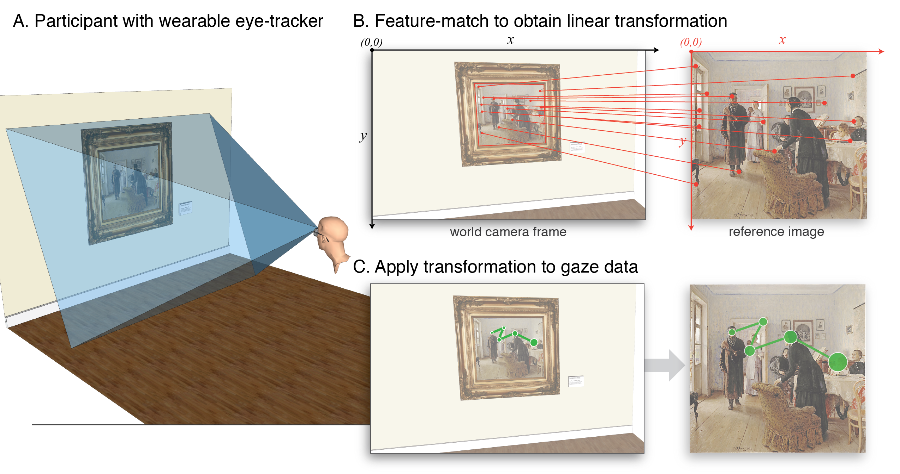

# Glasses Calibration

This repository contains:

1. Analysis pipeline for automated dynamic gaze mapping
2. Code and results for accuracy and precision comparisons across two models of wearable eye-tracker

## Analysis Pipeline:
Wearable eye-trackers introduce the challenge of translating recorded gaze locations from a egocentric coordinate system (i.e. the outward facing camera on the glasses which records the participant's point-of-view) and a fixed reference stimulus in the environment. This pipeline is used to detect a specific target stimulus in the enviorment, and then transform the gaze data to be expressed relative to the target:

This pipeline currently supports the following wearable eye-trackers:

* Pupil Labs
* Tobii Pro Glasses 2
* SMI ETG 2

*For more information look in:* **gazeMappingPipeline/gazeMappingGuide.md**

## Accuracy/Precision Comparisons
We benchmarked accuracy and precision performance across 3 models of wearable eye-tracker (Pupil Labs 120 Hz Binocular, Tobii Pro Glasses 2, SMI ETG 2)

*For results and stats, see:* **analysis/calibrationAnalyses.md**

