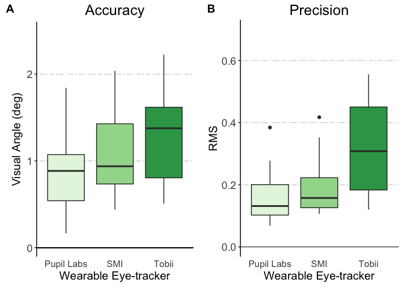

# Wearable Eye-tracker Calibration Analyses
jeff macinnes  
July 17, 2017  


# Wearable Eye-tracker Calibration Analyses

A set of analyses comparing calibration performance across 3 different models of wearable eye-trackers: Tobii Glasses 2, SMI, and Pupil Labs. Each tracker was tested on 3 different subjects. Each subject performed calibration tasks at 3 different distances (1M, 2M, and 3M). At each distance, calibration was tested at 3 different conditons of visual angle offset (-10deg, 0deg, +10deg). The calibration task consisted of asking participants to fixate on a sequence of 9 calibration points (3 x 3 grid) presented in a random order for 3 seconds each. The analysis focuses on the gaze data collected between 500ms and 2500ms on each point.

## Read in processed calibration data file
Each row represents the calibration performance summary for one pt (of 9) for one conditon for one subject. 


```r
library(readr)
library(knitr)

calibData <- read_delim("allSubjs_calibrationSummary.tsv", delim="\t")
kable(calibData[1:5,], caption='Calibration Data, all subjects')
```


Table: Calibration Data, all subjects

 trial   ptIdx   percentValid     centX     centY   centDist   centAngle     RMS   subj  glasses      dist   offset   condition             
------  ------  -------------  --------  --------  ---------  ----------  ------  -----  -----------  -----  -------  ----------------------
     1      15          0.992   872.513   456.424      0.683      48.041   0.113    101  Pupil Labs   1M     0deg     101_PupilLabs_1M_0deg 
     2      21          0.996   178.414   736.665      1.135      83.071   0.074    101  Pupil Labs   1M     0deg     101_PupilLabs_1M_0deg 
     3       3          0.992   529.483   128.252      0.564      52.494   0.114    101  Pupil Labs   1M     0deg     101_PupilLabs_1M_0deg 
     4      13          0.988   537.017   401.570      1.226      69.390   0.123    101  Pupil Labs   1M     0deg     101_PupilLabs_1M_0deg 
     5      25          0.992   862.071   709.513      1.481      76.933   0.087    101  Pupil Labs   1M     0deg     101_PupilLabs_1M_0deg 

**Variable Descriptions** 

- trial: trial number  
- ptIdx: points on calibration grid were numbered from left to right, top to bottom. 25 points total, of which subjects were asked to fixate on a subset of 9.  
- percentValid: within the 2000ms window on each trial that is selected for analysis, this represented the percentage of *expected* datapoints with valid data  
- centX: mean x-coordinate of all gaze points on this trial
- centY: mean y-coordinate of all gaze points on this trial
- centDist: **accuracy measure** distance (in degrees of visual angle) of mean gaze point from the expected location
- centAngle: theta (in degrees) of mean gaze point relative to the expected location. 0 degs is at (1,0) on unit circle, and increases in a counterclockwise direction
- RMS: **precision measure**. Root mean square distance of all gaze points in this trial from each other
- subj: subject number
- dist: subject distance from the target on this trial
- offset: target offset (in visual angle) from the subject on this trial; negative values to the subject's left, positive values to the right

## Average each condition across all calibration points
The calibData dataframe has summarized each individual calibration pt (9 total) for each unique condition. Before any other analyses, average the calibration performance across these 9pts for each condition


```r
# load dplyr library
library(dplyr)

# group by unique conditions, and take the mean of all numeric columns
dat <- calibData %>% 
  group_by(subj, glasses, dist, offset) %>%
  summarise_if(is.numeric, mean)

# drop the columns that are now irrelevant
dat <- dat %>% select(-one_of(c("trial", "ptIdx")))

# show a table
kable(dat[1:5,], caption='Calibration data, mean by unique condition')
```


Table: Calibration data, mean by unique condition

 subj  glasses      dist   offset    percentValid      centX      centY   centDist   centAngle         RMS
-----  -----------  -----  -------  -------------  ---------  ---------  ---------  ----------  ----------
  101  Pupil Labs   1M     0deg         0.9924444   520.2073   412.2368   1.085667    75.04156   0.1073333
  101  Pupil Labs   1M     10Ldeg       0.9920000   461.4270   433.8628   1.266556   121.67722   0.1593333
  101  Pupil Labs   1M     10Rdeg       0.9483333   604.4734   413.1897   1.649778    74.17467   0.1297778
  101  Pupil Labs   2M     0deg         0.9924444   338.9074   381.4510   1.178778   143.40244   0.0801111
  101  Pupil Labs   2M     10Ldeg       0.9901111   188.1186   499.2804   1.841111   179.78633   0.1026667

# Models  

---
## Overall  
Collapsing across all conditions (distance and visual angle offset)

#### Accuracy
Test if there's an overall effect of glasses model on accuracy (i.e. centDist). Collapsing across all distance and offset, with subject as a random effect


```r
# load the nlme packages, which includes functions for fitting mixed models
library(lme4)
library(lmerTest)

# build a linear mixed effects model predicting centDist as a function of glasses, with subj as a random effect
overallAcc <- lmer(centDist ~ glasses + (1|subj), data=dat)
summary(overallAcc)
```

```
## Linear mixed model fit by REML t-tests use Satterthwaite approximations
##   to degrees of freedom [lmerMod]
## Formula: centDist ~ glasses + (1 | subj)
##    Data: dat
## 
## REML criterion at convergence: 141
## 
## Scaled residuals: 
##     Min      1Q  Median      3Q     Max 
## -1.6398 -0.7497 -0.0891  0.4709  3.6642 
## 
## Random effects:
##  Groups   Name        Variance Std.Dev.
##  subj     (Intercept) 0.0000   0.0000  
##  Residual             0.3144   0.5607  
## Number of obs: 81, groups:  subj, 3
## 
## Fixed effects:
##              Estimate Std. Error      df t value Pr(>|t|)    
## (Intercept)    0.8434     0.1079 78.0000   7.816 2.14e-11 ***
## glassesSMI     0.3667     0.1526 78.0000   2.403 0.018634 *  
## glassesTobii   0.5820     0.1526 78.0000   3.814 0.000272 ***
## ---
## Signif. codes:  0 '***' 0.001 '**' 0.01 '*' 0.05 '.' 0.1 ' ' 1
## 
## Correlation of Fixed Effects:
##             (Intr) glsSMI
## glassesSMI  -0.707       
## glassesTobi -0.707  0.500
```

```r
anova(overallAcc)
```

```
## Analysis of Variance Table of type III  with  Satterthwaite 
## approximation for degrees of freedom
##         Sum Sq Mean Sq NumDF DenDF F.value   Pr(>F)   
## glasses 4.6766  2.3383     2    78  7.4381 0.001105 **
## ---
## Signif. codes:  0 '***' 0.001 '**' 0.01 '*' 0.05 '.' 0.1 ' ' 1
```

Glasses model is a significant predictor of overall accuracy. Next, run post-hocs to look for significant differences between glasses. (Methods for running pairwise t-tests on linear model object found at: https://stats.stackexchange.com/questions/237512/how-to-perform-post-hoc-test-on-lmer-model)


```r
library(multcomp)
summary(glht(overallAcc, linfct = mcp(glasses = "Tukey")), test = adjusted("holm"))
```

```
## 
## 	 Simultaneous Tests for General Linear Hypotheses
## 
## Multiple Comparisons of Means: Tukey Contrasts
## 
## 
## Fit: lme4::lmer(formula = centDist ~ glasses + (1 | subj), data = dat)
## 
## Linear Hypotheses:
##                         Estimate Std. Error z value Pr(>|z|)    
## SMI - Pupil Labs == 0     0.3667     0.1526   2.403  0.03252 *  
## Tobii - Pupil Labs == 0   0.5820     0.1526   3.814  0.00041 ***
## Tobii - SMI == 0          0.2153     0.1526   1.411  0.15820    
## ---
## Signif. codes:  0 '***' 0.001 '**' 0.01 '*' 0.05 '.' 0.1 ' ' 1
## (Adjusted p values reported -- holm method)
```

Pupil Labs show significantly better Accuracy than either SMI or Tobii. No significant difference between SMI and Tobii

#### Precision
Test if there's an overall effect of glasses model on precision (i.e. RMS). Collapsing across all distance and offset, with subject as a random effect


```r
# build a linear mixed effects model predicting RMS as a function of glasses, with subj as a random effect
overallPrec <- lmer(RMS ~ glasses + (1|subj), data=dat)
summary(overallPrec)
```

```
## Linear mixed model fit by REML t-tests use Satterthwaite approximations
##   to degrees of freedom [lmerMod]
## Formula: RMS ~ glasses + (1 | subj)
##    Data: dat
## 
## REML criterion at convergence: -130.9
## 
## Scaled residuals: 
##     Min      1Q  Median      3Q     Max 
## -1.8511 -0.4202 -0.0327  0.4517  4.6425 
## 
## Random effects:
##  Groups   Name        Variance Std.Dev.
##  subj     (Intercept) 0.004852 0.06966 
##  Residual             0.008970 0.09471 
## Number of obs: 81, groups:  subj, 3
## 
## Fixed effects:
##              Estimate Std. Error       df t value Pr(>|t|)    
## (Intercept)   0.15736    0.04415  2.54000   3.564    0.049 *  
## glassesSMI    0.03058    0.02578 76.00000   1.187    0.239    
## glassesTobii  0.17944    0.02578 76.00000   6.961 1.04e-09 ***
## ---
## Signif. codes:  0 '***' 0.001 '**' 0.01 '*' 0.05 '.' 0.1 ' ' 1
## 
## Correlation of Fixed Effects:
##             (Intr) glsSMI
## glassesSMI  -0.292       
## glassesTobi -0.292  0.500
```

```r
anova(overallPrec)
```

```
## Analysis of Variance Table of type III  with  Satterthwaite 
## approximation for degrees of freedom
##          Sum Sq Mean Sq NumDF DenDF F.value    Pr(>F)    
## glasses 0.49763 0.24882     2    76  27.739 9.004e-10 ***
## ---
## Signif. codes:  0 '***' 0.001 '**' 0.01 '*' 0.05 '.' 0.1 ' ' 1
```

Glasses model is a significant predictor of overall precision. Run Post hoc t-tests to make comparisons between models


```r
summary(glht(overallPrec, linfct = mcp(glasses = "Tukey")), test = adjusted("holm"))
```

```
## 
## 	 Simultaneous Tests for General Linear Hypotheses
## 
## Multiple Comparisons of Means: Tukey Contrasts
## 
## 
## Fit: lme4::lmer(formula = RMS ~ glasses + (1 | subj), data = dat)
## 
## Linear Hypotheses:
##                         Estimate Std. Error z value Pr(>|z|)    
## SMI - Pupil Labs == 0    0.03058    0.02578   1.187    0.235    
## Tobii - Pupil Labs == 0  0.17944    0.02578   6.961 1.01e-11 ***
## Tobii - SMI == 0         0.14886    0.02578   5.775 1.54e-08 ***
## ---
## Signif. codes:  0 '***' 0.001 '**' 0.01 '*' 0.05 '.' 0.1 ' ' 1
## (Adjusted p values reported -- holm method)
```

Tobii exhibits significantly different precision than either SMI or Pupil Labs. No significant difference between SMI and Pupil Labs. 

#### Overall Accuracy and Precision Plots


```r
# overall Accuracy plot
library(ggplot2)
library(ggthemes)
library(ggpubr)

## Accuracy
accPlot <- ggplot(aes(y = centDist, x = glasses, fill=glasses), 
       data = dat) +
  geom_boxplot() +
  labs( 
    x = "Wearable Eye-tracker",
    y = "Visual Angle (deg)",
    title="Accuracy"
    ) +
  scale_fill_brewer(palette="Greens") +
  scale_y_continuous(breaks=seq(0,2,by=1), limits=c(0,2.5), expand=c(0,.1)) +
  theme(
    aspect.ratio = 1.5,
    panel.background = element_blank(),
    plot.title = element_text(hjust=.5, size=18),
    axis.title = element_text(size=rel(1.3)),
    axis.text.x = element_text(size = rel(1.3)),
    axis.text.y = element_text(size = rel(1.5)),
    axis.line.y = element_line(colour = "black", size = .5, linetype = "solid"),
    axis.ticks.x = element_blank(),
    panel.grid.major.y = element_line(colour="darkgrey", linetype = "twodash", size=.25),
    legend.position = "none",
  ) +
  geom_segment(aes(x = .4, y = 0, xend = 3.6, yend = 0), size=.25)


## Precision
rmsPlot <- ggplot(aes(y = RMS, x = glasses, fill=glasses), 
                  data = dat) +
  geom_boxplot() +
  labs( 
    x = "Wearable Eye-tracker",
    y = "RMS",
    title="Precision"
  ) +
  scale_fill_brewer(palette="Greens") +
  scale_y_continuous(breaks=seq(0,.8,by=.2), limits=c(0,.7), expand=c(0,.03)) +
  theme(
    aspect.ratio = 1.5,
    panel.background = element_blank(),
    plot.title = element_text(hjust=.5, size=18),
    axis.title = element_text(size=rel(1.3)),
    axis.text.x = element_text(size = rel(1.3)),
    axis.text.y = element_text(size = rel(1.5)),
    axis.line.y = element_line(colour = "black", size = .5, linetype = "solid"),
    axis.ticks.x = element_blank(),
    panel.grid.major.y = element_line(colour="darkgrey", linetype = "twodash", size=.25),
    legend.position = "none",
  ) +
  geom_segment(aes(x = .4, y = 0, xend = 3.6, yend = 0), size=.25)

## Combine plots
ggarrange(accPlot, rmsPlot,  
          labels = c("A", "B"),
          ncol = 2, nrow = 1) + 
  ggsave("figs/overallAccPrec.pdf", width = 8, height = 5)
```

<!-- -->


** Models to run **  

	- ~~Overall (avg across all distance and offset conditions)~~
		- ~~accuracy x glasses model~~
		- ~~precision x glasses model~~

	- Distance (fixed offset, 0deg)
		- accuracy x distance x glasses model
		- precision x distance x glasses model

	- Distance + Offset
		- accuracy x distance x offset x glasses model
		- precision x distance x offset x glasses model


## Session Info  
Display all session info (R and R package version numbers)

```r
sessionInfo()
```

```
## R version 3.4.0 (2017-04-21)
## Platform: x86_64-apple-darwin15.6.0 (64-bit)
## Running under: OS X El Capitan 10.11.6
## 
## Matrix products: default
## BLAS: /Library/Frameworks/R.framework/Versions/3.4/Resources/lib/libRblas.0.dylib
## LAPACK: /Library/Frameworks/R.framework/Versions/3.4/Resources/lib/libRlapack.dylib
## 
## locale:
## [1] en_US.UTF-8/en_US.UTF-8/en_US.UTF-8/C/en_US.UTF-8/en_US.UTF-8
## 
## attached base packages:
## [1] stats     graphics  grDevices utils     datasets  methods   base     
## 
## other attached packages:
##  [1] ggpubr_0.1.4    magrittr_1.5    ggthemes_3.4.0  ggplot2_2.2.1  
##  [5] multcomp_1.4-6  TH.data_1.0-8   MASS_7.3-47     survival_2.41-3
##  [9] mvtnorm_1.0-6   lmerTest_2.0-33 lme4_1.1-13     Matrix_1.2-10  
## [13] dplyr_0.7.2     knitr_1.16      readr_1.1.1    
## 
## loaded via a namespace (and not attached):
##  [1] zoo_1.8-0           purrr_0.2.2.2       splines_3.4.0      
##  [4] lattice_0.20-35     colorspace_1.3-2    htmltools_0.3.6    
##  [7] yaml_2.1.14         base64enc_0.1-3     rlang_0.1.1        
## [10] nloptr_1.0.4        foreign_0.8-69      glue_1.1.1         
## [13] RColorBrewer_1.1-2  bindrcpp_0.2        bindr_0.1          
## [16] plyr_1.8.4          stringr_1.2.0       munsell_0.4.3      
## [19] gtable_0.2.0        htmlwidgets_0.9     codetools_0.2-15   
## [22] evaluate_0.10.1     labeling_0.3        latticeExtra_0.6-28
## [25] htmlTable_1.9       highr_0.6           Rcpp_0.12.12       
## [28] acepack_1.4.1       scales_0.4.1        backports_1.1.0    
## [31] checkmate_1.8.3     Hmisc_4.0-3         gridExtra_2.2.1    
## [34] hms_0.3             digest_0.6.12       stringi_1.1.5      
## [37] cowplot_0.7.0       grid_3.4.0          rprojroot_1.2      
## [40] tools_3.4.0         sandwich_2.3-4      lazyeval_0.2.0     
## [43] tibble_1.3.3        Formula_1.2-2       cluster_2.0.6      
## [46] pkgconfig_2.0.1     data.table_1.10.4   assertthat_0.2.0   
## [49] minqa_1.2.4         rmarkdown_1.6       R6_2.2.2           
## [52] rpart_4.1-11        nnet_7.3-12         nlme_3.1-131       
## [55] compiler_3.4.0
```


