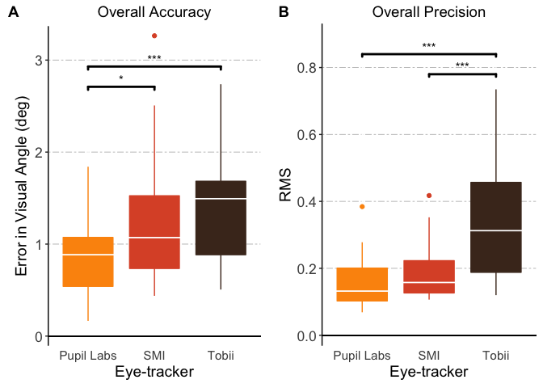

Wearable Eye-tracker Calibration Analyses
================
jeff macinnes
2017-08-03

Wearable Eye-tracker Calibration Analyses
=========================================

A set of analyses comparing calibration performance across 3 different models of wearable eye-trackers: Tobii Glasses 2, SMI, and Pupil Labs. Each tracker was tested on 3 different subjects. Each subject performed calibration tasks at 3 different distances (1M, 2M, and 3M). At each distance, calibration was tested at 3 different conditons of visual angle offset (-10deg, 0deg, +10deg). The calibration task consisted of asking participants to fixate on a sequence of 9 calibration points (3 x 3 grid) presented in a random order for 3 seconds each. The analysis focuses on the gaze data collected between 500ms and 2500ms on each point.

Read in processed calibration data file
---------------------------------------

Each row represents the calibration performance summary for one pt (of 9) for one conditon for one subject.

``` r
library(readr)
library(knitr)

calibData <- read_delim("allSubjs_calibrationSummary.tsv", delim="\t")
kable(calibData[1:5,], caption='Calibration Data, all subjects')
```

|  trial|  ptIdx|  percentValid|    centX|    centY|  centDist|  centAngle|    RMS|  subj| glasses    | dist | offset | condition                |
|------:|------:|-------------:|--------:|--------:|---------:|----------:|------:|-----:|:-----------|:-----|:-------|:-------------------------|
|      1|     15|         0.992|  872.513|  456.424|     0.683|     48.041|  0.113|   101| Pupil Labs | 1M   | 0deg   | 101\_PupilLabs\_1M\_0deg |
|      2|     21|         0.996|  178.414|  736.665|     1.135|     83.071|  0.074|   101| Pupil Labs | 1M   | 0deg   | 101\_PupilLabs\_1M\_0deg |
|      3|      3|         0.992|  529.483|  128.252|     0.564|     52.494|  0.114|   101| Pupil Labs | 1M   | 0deg   | 101\_PupilLabs\_1M\_0deg |
|      4|     13|         0.988|  537.017|  401.570|     1.226|     69.390|  0.123|   101| Pupil Labs | 1M   | 0deg   | 101\_PupilLabs\_1M\_0deg |
|      5|     25|         0.992|  862.071|  709.513|     1.481|     76.933|  0.087|   101| Pupil Labs | 1M   | 0deg   | 101\_PupilLabs\_1M\_0deg |

**Variable Descriptions**

-   trial: trial number
-   ptIdx: points on calibration grid were numbered from left to right, top to bottom. 25 points total, of which subjects were asked to fixate on a subset of 9.
-   percentValid: within the 2000ms window on each trial that is selected for analysis, this represented the percentage of *expected* datapoints with valid data
-   centX: mean x-coordinate of all gaze points on this trial
-   centY: mean y-coordinate of all gaze points on this trial
-   centDist: **accuracy measure** distance (in degrees of visual angle) of mean gaze point from the expected location
-   centAngle: theta (in degrees) of mean gaze point relative to the expected location. 0 degs is at (1,0) on unit circle, and increases in a counterclockwise direction
-   RMS: **precision measure**. Root mean square distance of all gaze points in this trial from each other
-   subj: subject number
-   dist: subject distance from the target on this trial
-   offset: target offset (in visual angle) from the subject on this trial; negative values to the subject's left, positive values to the right

Average each condition across all calibration points
----------------------------------------------------

The calibData dataframe has summarized each individual calibration pt (9 total) for each unique condition. Before any other analyses, average the calibration performance across these 9pts for each condition

``` r
# load dplyr library
library(dplyr)

# group by unique conditions, and take the mean of all numeric columns
dat <- calibData %>% 
  group_by(subj, glasses, dist, offset) %>%
  summarise_if(is.numeric, mean)

# drop the columns that are now irrelevant
dat <- dat %>% select(-one_of(c("trial", "ptIdx")))

# set condition and subj vars as factors
dat$subj <- factor(dat$subj)
dat$glasses <- factor(dat$glasses)
dat$dist <- factor(dat$dist)
dat$offset <- factor(dat$offset)

# show a table
kable(dat[1:5,], caption='Calibration data, mean by unique condition')
```

| subj | glasses    | dist | offset |  percentValid|     centX|     centY|  centDist|  centAngle|        RMS|
|:-----|:-----------|:-----|:-------|-------------:|---------:|---------:|---------:|----------:|----------:|
| 101  | Pupil Labs | 1M   | 0deg   |     0.9924444|  520.2073|  412.2368|  1.085667|   75.04156|  0.1073333|
| 101  | Pupil Labs | 1M   | 10Ldeg |     0.9920000|  461.4270|  433.8628|  1.266556|  121.67722|  0.1593333|
| 101  | Pupil Labs | 1M   | 10Rdeg |     0.9483333|  604.4734|  413.1897|  1.649778|   74.17467|  0.1297778|
| 101  | Pupil Labs | 2M   | 0deg   |     0.9924444|  338.9074|  381.4510|  1.178778|  143.40244|  0.0801111|
| 101  | Pupil Labs | 2M   | 10Ldeg |     0.9901111|  188.1186|  499.2804|  1.841111|  179.78633|  0.1026667|

Model the data
==============

------------------------------------------------------------------------

Overall
-------

Collapsing across all conditions, is glasses model a significant predictor of accuracy or precision? Fit a linear mixed-effects model with glasses (fixed effect) and subject (random effect).

#### Accuracy

``` r
# load the lme4 packages, which includes functions for fitting mixed models
library(lme4)
library(lmerTest)

# build linear mixed effects model predicting accuracy (i.e. centDist) 
accMod.overall <- lmer(centDist ~ glasses + (1|subj), data=dat)
summary(accMod.overall)
```

    ## Linear mixed model fit by REML t-tests use Satterthwaite approximations
    ##   to degrees of freedom [lmerMod]
    ## Formula: centDist ~ glasses + (1 | subj)
    ##    Data: dat
    ## 
    ## REML criterion at convergence: 141
    ## 
    ## Scaled residuals: 
    ##     Min      1Q  Median      3Q     Max 
    ## -1.6398 -0.7497 -0.0891  0.4709  3.6642 
    ## 
    ## Random effects:
    ##  Groups   Name        Variance Std.Dev.
    ##  subj     (Intercept) 0.0000   0.0000  
    ##  Residual             0.3144   0.5607  
    ## Number of obs: 81, groups:  subj, 3
    ## 
    ## Fixed effects:
    ##              Estimate Std. Error      df t value Pr(>|t|)    
    ## (Intercept)    0.8434     0.1079 78.0000   7.816 2.14e-11 ***
    ## glassesSMI     0.3667     0.1526 78.0000   2.403 0.018634 *  
    ## glassesTobii   0.5820     0.1526 78.0000   3.814 0.000272 ***
    ## ---
    ## Signif. codes:  0 '***' 0.001 '**' 0.01 '*' 0.05 '.' 0.1 ' ' 1
    ## 
    ## Correlation of Fixed Effects:
    ##             (Intr) glsSMI
    ## glassesSMI  -0.707       
    ## glassesTobi -0.707  0.500

``` r
anova(accMod.overall)
```

    ## Analysis of Variance Table of type III  with  Satterthwaite 
    ## approximation for degrees of freedom
    ##         Sum Sq Mean Sq NumDF DenDF F.value   Pr(>F)   
    ## glasses 4.6766  2.3383     2    78  7.4381 0.001105 **
    ## ---
    ## Signif. codes:  0 '***' 0.001 '**' 0.01 '*' 0.05 '.' 0.1 ' ' 1

Glasses Model is a significant predictor of accuracy. Note that including *subj* as a random effect in this model did not account for any additional variance. Next, run pairwise comparisons on glasses models to look for overall differences between glasses models. (Methods for running pairwise t-tests on linear model object found at: <https://stats.stackexchange.com/questions/237512/how-to-perform-post-hoc-test-on-lmer-model>)

``` r
library(lsmeans)
lsmeans(accMod.overall, pairwise ~ glasses)
```

    ## $lsmeans
    ##  glasses       lsmean        SE df  lower.CL upper.CL
    ##  Pupil Labs 0.8433663 0.1079037 78 0.6285464 1.058186
    ##  SMI        1.2100700 0.1079037 78 0.9952501 1.424890
    ##  Tobii      1.4254115 0.1079037 78 1.2105917 1.640231
    ## 
    ## Degrees-of-freedom method: satterthwaite 
    ## Confidence level used: 0.95 
    ## 
    ## $contrasts
    ##  contrast             estimate        SE df t.ratio p.value
    ##  Pupil Labs - SMI   -0.3667037 0.1525989 78  -2.403  0.0484
    ##  Pupil Labs - Tobii -0.5820453 0.1525989 78  -3.814  0.0008
    ##  SMI - Tobii        -0.2153416 0.1525989 78  -1.411  0.3402
    ## 
    ## P value adjustment: tukey method for comparing a family of 3 estimates

Overall, there is a significant difference in accuracy between Pupil Labs and SMI, and Pupil Labs and Tobii. No significant different between SMI and Tobii.

#### Precision

Fit a similar linear mixed-effects model looking at precision instead of accuracy.

``` r
# build linear mixed effects model predicting precision (i.e. RMS) 
precMod.overall <- lmer(RMS ~ glasses + (1|subj), data=dat)
summary(precMod.overall)
```

    ## Linear mixed model fit by REML t-tests use Satterthwaite approximations
    ##   to degrees of freedom [lmerMod]
    ## Formula: RMS ~ glasses + (1 | subj)
    ##    Data: dat
    ## 
    ## REML criterion at convergence: -130.9
    ## 
    ## Scaled residuals: 
    ##     Min      1Q  Median      3Q     Max 
    ## -1.8511 -0.4202 -0.0327  0.4517  4.6425 
    ## 
    ## Random effects:
    ##  Groups   Name        Variance Std.Dev.
    ##  subj     (Intercept) 0.004852 0.06966 
    ##  Residual             0.008970 0.09471 
    ## Number of obs: 81, groups:  subj, 3
    ## 
    ## Fixed effects:
    ##              Estimate Std. Error       df t value Pr(>|t|)    
    ## (Intercept)   0.15736    0.04415  2.54000   3.564    0.049 *  
    ## glassesSMI    0.03058    0.02578 76.00000   1.187    0.239    
    ## glassesTobii  0.17944    0.02578 76.00000   6.961 1.04e-09 ***
    ## ---
    ## Signif. codes:  0 '***' 0.001 '**' 0.01 '*' 0.05 '.' 0.1 ' ' 1
    ## 
    ## Correlation of Fixed Effects:
    ##             (Intr) glsSMI
    ## glassesSMI  -0.292       
    ## glassesTobi -0.292  0.500

``` r
anova(precMod.overall)
```

    ## Analysis of Variance Table of type III  with  Satterthwaite 
    ## approximation for degrees of freedom
    ##          Sum Sq Mean Sq NumDF DenDF F.value    Pr(>F)    
    ## glasses 0.49763 0.24882     2    76  27.739 9.004e-10 ***
    ## ---
    ## Signif. codes:  0 '***' 0.001 '**' 0.01 '*' 0.05 '.' 0.1 ' ' 1

Glasses model is a significant predictor of overall precision. Next, run pairwise comparisons on glasses models to look for overall differences between glasses models.

``` r
lsmeans(precMod.overall, pairwise ~ glasses)
```

    ## $lsmeans
    ##  glasses       lsmean         SE   df    lower.CL  upper.CL
    ##  Pupil Labs 0.1573621 0.04415451 2.54 0.001477721 0.3132466
    ##  SMI        0.1879465 0.04415451 2.54 0.032062083 0.3438309
    ##  Tobii      0.3368025 0.04415451 2.54 0.180918050 0.4926869
    ## 
    ## Degrees-of-freedom method: satterthwaite 
    ## Confidence level used: 0.95 
    ## 
    ## $contrasts
    ##  contrast              estimate         SE df t.ratio p.value
    ##  Pupil Labs - SMI   -0.03058436 0.02577657 76  -1.187  0.4648
    ##  Pupil Labs - Tobii -0.17944033 0.02577657 76  -6.961  <.0001
    ##  SMI - Tobii        -0.14885597 0.02577657 76  -5.775  <.0001
    ## 
    ## P value adjustment: tukey method for comparing a family of 3 estimates

Tobii exhibits significantly different precision than either SMI or Pupil Labs. No significant difference between SMI and Pupil Labs.

#### Overall Accuracy and Precision Plots

Plot Accuracy and Precision by Glasses Model

``` r
# overall Accuracy plot
library(ggplot2)
library(ggthemes)
library(ggpubr)

## Accuracy
accPlot <- ggplot(aes(y = centDist, x = glasses, fill=glasses), 
       data = dat) +
  geom_boxplot() +
  labs( 
    x = "Wearable Eye-tracker",
    y = "Visual Angle (deg)",
    title="Accuracy"
    ) +
  scale_fill_brewer(palette="Greens") +
  scale_y_continuous(breaks=seq(0,2,by=1), limits=c(0,2.5), expand=c(0,.1)) +
  theme(
    aspect.ratio = 1.5,
    panel.background = element_blank(),
    plot.title = element_text(hjust=.5, size=18),
    axis.title = element_text(size=rel(1.3)),
    axis.text.x = element_text(size = rel(1.3)),
    axis.text.y = element_text(size = rel(1.5)),
    axis.line.y = element_line(colour = "black", size = .5, linetype = "solid"),
    axis.ticks.x = element_blank(),
    panel.grid.major.y = element_line(colour="darkgrey", linetype = "twodash", size=.25),
    legend.position = "none",
  ) +
  geom_segment(aes(x = .4, y = 0, xend = 3.6, yend = 0), size=.25)


## Precision
rmsPlot <- ggplot(aes(y = RMS, x = glasses, fill=glasses), 
                  data = dat) +
  labs( 
    x = "Wearable Eye-tracker",
    y = "RMS",
    title="Precision"
  ) +
  geom_boxplot() + 
  scale_fill_brewer(palette="Greens") +
  scale_y_continuous(breaks=seq(0,.8,by=.2), limits=c(0,.7), expand=c(0,.03)) +
  theme(
    aspect.ratio = 1.5,
    panel.background = element_blank(),
    plot.title = element_text(hjust=.5, size=18),
    axis.title = element_text(size=rel(1.3)),
    axis.text.x = element_text(size = rel(1.3)),
    axis.text.y = element_text(size = rel(1.5)),
    axis.line.y = element_line(colour = "black", size = .5, linetype = "solid"),
    axis.ticks.x = element_blank(),
    panel.grid.major.y = element_line(colour="darkgrey", linetype = "twodash", size=.25),
    legend.position = "none",
  ) +
  geom_segment(aes(x = .4, y = 0, xend = 3.6, yend = 0), size=.25)

## Combine plots
ggarrange(accPlot, rmsPlot,  
          labels = c("A", "B"),
          ncol = 2, nrow = 1) + 
  ggsave("figs/overallAccPrec.pdf", width = 8, height = 5)
```



------------------------------------------------------------------------

Full Model
----------

Fit new accuracy and precision models that include the distance and offset conditions as additional predictors. This model will have the following main effects:

-   **glasses**
-   **distance**
-   **offset**

and the following interactions:

-   **glasses** X **distance**
-   **glasses** X **offset**
-   **glasses** X **distance** X **offset**

#### Accuracy

``` r
# full accuracy model
accMod.full <- lmer(centDist ~ glasses*dist*offset + (1|subj), data=dat)
summary(accMod.full)
```

    ## Linear mixed model fit by REML t-tests use Satterthwaite approximations
    ##   to degrees of freedom [lmerMod]
    ## Formula: centDist ~ glasses * dist * offset + (1 | subj)
    ##    Data: dat
    ## 
    ## REML criterion at convergence: 112
    ## 
    ## Scaled residuals: 
    ##     Min      1Q  Median      3Q     Max 
    ## -1.8403 -0.5241 -0.0721  0.3631  3.3604 
    ## 
    ## Random effects:
    ##  Groups   Name        Variance  Std.Dev. 
    ##  subj     (Intercept) 3.342e-22 1.828e-11
    ##  Residual             2.690e-01 5.186e-01
    ## Number of obs: 81, groups:  subj, 3
    ## 
    ## Fixed effects:
    ##                                  Estimate Std. Error       df t value
    ## (Intercept)                       0.93441    0.29942 54.00000   3.121
    ## glassesSMI                       -0.05641    0.42344 54.00000  -0.133
    ## glassesTobii                     -0.27063    0.42344 54.00000  -0.639
    ## dist2M                            0.16741    0.42344 54.00000   0.395
    ## dist3M                           -0.44144    0.42344 54.00000  -1.043
    ## offset10Ldeg                      0.13152    0.42344 54.00000   0.311
    ## offset10Rdeg                      0.09522    0.42344 54.00000   0.225
    ## glassesSMI:dist2M                 0.08459    0.59884 54.00000   0.141
    ## glassesTobii:dist2M               0.96626    0.59884 54.00000   1.614
    ## glassesSMI:dist3M                 0.31578    0.59884 54.00000   0.527
    ## glassesTobii:dist3M               1.61044    0.59884 54.00000   2.689
    ## glassesSMI:offset10Ldeg           0.51233    0.59884 54.00000   0.856
    ## glassesTobii:offset10Ldeg         0.21748    0.59884 54.00000   0.363
    ## glassesSMI:offset10Rdeg           0.69511    0.59884 54.00000   1.161
    ## glassesTobii:offset10Rdeg         0.24307    0.59884 54.00000   0.406
    ## dist2M:offset10Ldeg              -0.15337    0.59884 54.00000  -0.256
    ## dist3M:offset10Ldeg              -0.08052    0.59884 54.00000  -0.134
    ## dist2M:offset10Rdeg              -0.32081    0.59884 54.00000  -0.536
    ## dist3M:offset10Rdeg              -0.12278    0.59884 54.00000  -0.205
    ## glassesSMI:dist2M:offset10Ldeg   -0.65133    0.84688 54.00000  -0.769
    ## glassesTobii:dist2M:offset10Ldeg -0.94170    0.84688 54.00000  -1.112
    ## glassesSMI:dist3M:offset10Ldeg   -0.31463    0.84688 54.00000  -0.372
    ## glassesTobii:dist3M:offset10Ldeg -0.25522    0.84688 54.00000  -0.301
    ## glassesSMI:dist2M:offset10Rdeg   -0.06848    0.84688 54.00000  -0.081
    ## glassesTobii:dist2M:offset10Rdeg  0.10056    0.84688 54.00000   0.119
    ## glassesSMI:dist3M:offset10Rdeg    0.01900    0.84688 54.00000   0.022
    ## glassesTobii:dist3M:offset10Rdeg -0.34133    0.84688 54.00000  -0.403
    ##                                  Pr(>|t|)   
    ## (Intercept)                       0.00289 **
    ## glassesSMI                        0.89452   
    ## glassesTobii                      0.52545   
    ## dist2M                            0.69414   
    ## dist3M                            0.30182   
    ## offset10Ldeg                      0.75730   
    ## offset10Rdeg                      0.82292   
    ## glassesSMI:dist2M                 0.88819   
    ## glassesTobii:dist2M               0.11245   
    ## glassesSMI:dist3M                 0.60013   
    ## glassesTobii:dist3M               0.00950 **
    ## glassesSMI:offset10Ldeg           0.39603   
    ## glassesTobii:offset10Ldeg         0.71789   
    ## glassesSMI:offset10Rdeg           0.25084   
    ## glassesTobii:offset10Rdeg         0.68641   
    ## dist2M:offset10Ldeg               0.79884   
    ## dist3M:offset10Ldeg               0.89354   
    ## dist2M:offset10Rdeg               0.59434   
    ## dist3M:offset10Rdeg               0.83832   
    ## glassesSMI:dist2M:offset10Ldeg    0.44519   
    ## glassesTobii:dist2M:offset10Ldeg  0.27108   
    ## glassesSMI:dist3M:offset10Ldeg    0.71171   
    ## glassesTobii:dist3M:offset10Ldeg  0.76429   
    ## glassesSMI:dist2M:offset10Rdeg    0.93585   
    ## glassesTobii:dist2M:offset10Rdeg  0.90592   
    ## glassesSMI:dist3M:offset10Rdeg    0.98218   
    ## glassesTobii:dist3M:offset10Rdeg  0.68850   
    ## ---
    ## Signif. codes:  0 '***' 0.001 '**' 0.01 '*' 0.05 '.' 0.1 ' ' 1

``` r
anova(accMod.full)
```

    ## Analysis of Variance Table of type III  with  Satterthwaite 
    ## approximation for degrees of freedom
    ##                     Sum Sq Mean Sq NumDF DenDF F.value   Pr(>F)    
    ## glasses             4.6766 2.33829     2    54  8.6940 0.000533 ***
    ## dist                0.5314 0.26571     2    54  0.9880 0.378967    
    ## offset              0.7601 0.38005     2    54  1.4131 0.252250    
    ## glasses:dist        5.4587 1.36467     4    54  5.0740 0.001519 ** 
    ## glasses:offset      1.3382 0.33455     4    54  1.2439 0.303443    
    ## dist:offset         1.1217 0.28042     4    54  1.0426 0.393888    
    ## glasses:dist:offset 0.7870 0.09838     8    54  0.3658 0.934037    
    ## ---
    ## Signif. codes:  0 '***' 0.001 '**' 0.01 '*' 0.05 '.' 0.1 ' ' 1

Fitting the full model to the accuracy data shows significant main effect of Glasses, and significant Glasses X Distance interaction.

Next, run the pairwise comparisons for glasses at each distance.

``` r
lsmeans(accMod.full, pairwise ~ glasses | dist)
```

    ## $lsmeans
    ## dist = 1M:
    ##  glasses       lsmean        SE df  lower.CL  upper.CL
    ##  Pupil Labs 1.0099877 0.1728691 54 0.6634060 1.3565693
    ##  SMI        1.3560617 0.1728691 54 1.0094801 1.7026434
    ##  Tobii      0.8928765 0.1728691 54 0.5462949 1.2394582
    ## 
    ## dist = 2M:
    ##  glasses       lsmean        SE df  lower.CL  upper.CL
    ##  Pupil Labs 1.0193333 0.1728691 54 0.6727517 1.3659150
    ##  SMI        1.2100617 0.1728691 54 0.8634801 1.5566434
    ##  Tobii      1.5880988 0.1728691 54 1.2415171 1.9346804
    ## 
    ## dist = 3M:
    ##  glasses       lsmean        SE df  lower.CL  upper.CL
    ##  Pupil Labs 0.5007778 0.1728691 54 0.1541961 0.8473594
    ##  SMI        1.0640864 0.1728691 54 0.7175048 1.4106681
    ##  Tobii      1.7952593 0.1728691 54 1.4486776 2.1418409
    ## 
    ## Results are averaged over the levels of: offset 
    ## Degrees-of-freedom method: satterthwaite 
    ## Confidence level used: 0.95 
    ## 
    ## $contrasts
    ## dist = 1M:
    ##  contrast             estimate        SE df t.ratio p.value
    ##  Pupil Labs - SMI   -0.3460741 0.2444738 54  -1.416  0.3401
    ##  Pupil Labs - Tobii  0.1171111 0.2444738 54   0.479  0.8815
    ##  SMI - Tobii         0.4631852 0.2444738 54   1.895  0.1500
    ## 
    ## dist = 2M:
    ##  contrast             estimate        SE df t.ratio p.value
    ##  Pupil Labs - SMI   -0.1907284 0.2444738 54  -0.780  0.7167
    ##  Pupil Labs - Tobii -0.5687654 0.2444738 54  -2.326  0.0606
    ##  SMI - Tobii        -0.3780370 0.2444738 54  -1.546  0.2777
    ## 
    ## dist = 3M:
    ##  contrast             estimate        SE df t.ratio p.value
    ##  Pupil Labs - SMI   -0.5633086 0.2444738 54  -2.304  0.0637
    ##  Pupil Labs - Tobii -1.2944815 0.2444738 54  -5.295  <.0001
    ##  SMI - Tobii        -0.7311728 0.2444738 54  -2.991  0.0115
    ## 
    ## Results are averaged over the levels of: offset 
    ## P value adjustment: tukey method for comparing a family of 3 estimates

For pairwise comparisons of glasses X distance (collapsing across offset), significant differences in accuracy at:

-   3M: Pupil Labs &gt; Tobii
-   3M: SMI &gt; Tobii

Trend-level differences at:

-   2M: Pupil Labs &gt; Tobii
-   3M: Pupil Labs &gt; SMI

**Insert plot of accuracy showing glasses X distance**

#### Precision

``` r
# full precision model
precMod.full <- lmer(RMS ~ glasses*dist*offset + (1|subj), data=dat)
summary(precMod.full)
```

    ## Linear mixed model fit by REML t-tests use Satterthwaite approximations
    ##   to degrees of freedom [lmerMod]
    ## Formula: RMS ~ glasses * dist * offset + (1 | subj)
    ##    Data: dat
    ## 
    ## REML criterion at convergence: -82
    ## 
    ## Scaled residuals: 
    ##      Min       1Q   Median       3Q      Max 
    ## -1.94615 -0.47708 -0.04613  0.35210  2.92797 
    ## 
    ## Random effects:
    ##  Groups   Name        Variance Std.Dev.
    ##  subj     (Intercept) 0.00494  0.07028 
    ##  Residual             0.00661  0.08130 
    ## Number of obs: 81, groups:  subj, 3
    ## 
    ## Fixed effects:
    ##                                    Estimate Std. Error         df t value
    ## (Intercept)                       0.1723333  0.0620473  9.3800000   2.777
    ## glassesSMI                       -0.0049259  0.0663827 52.0000000  -0.074
    ## glassesTobii                      0.0351852  0.0663827 52.0000000   0.530
    ## dist2M                            0.0133333  0.0663827 52.0000000   0.201
    ## dist3M                           -0.0551111  0.0663827 52.0000000  -0.830
    ## offset10Ldeg                      0.0006667  0.0663827 52.0000000   0.010
    ## offset10Rdeg                     -0.0075926  0.0663827 52.0000000  -0.114
    ## glassesSMI:dist2M                -0.0401852  0.0938792 52.0000000  -0.428
    ## glassesTobii:dist2M               0.0270741  0.0938792 52.0000000   0.288
    ## glassesSMI:dist3M                 0.0425185  0.0938792 52.0000000   0.453
    ## glassesTobii:dist3M               0.1425556  0.0938792 52.0000000   1.518
    ## glassesSMI:offset10Ldeg           0.1196667  0.0938792 52.0000000   1.275
    ## glassesTobii:offset10Ldeg         0.0989630  0.0938792 52.0000000   1.054
    ## glassesSMI:offset10Rdeg           0.0552593  0.0938792 52.0000000   0.589
    ## glassesTobii:offset10Rdeg         0.3392593  0.0938792 52.0000000   3.614
    ## dist2M:offset10Ldeg              -0.0312593  0.0938792 52.0000000  -0.333
    ## dist3M:offset10Ldeg               0.0397407  0.0938792 52.0000000   0.423
    ## dist2M:offset10Rdeg              -0.0290000  0.0938792 52.0000000  -0.309
    ## dist3M:offset10Rdeg               0.0318889  0.0938792 52.0000000   0.340
    ## glassesSMI:dist2M:offset10Ldeg   -0.0453704  0.1327653 52.0000000  -0.342
    ## glassesTobii:dist2M:offset10Ldeg -0.0271481  0.1327653 52.0000000  -0.204
    ## glassesSMI:dist3M:offset10Ldeg   -0.1223704  0.1327653 52.0000000  -0.922
    ## glassesTobii:dist3M:offset10Ldeg -0.1618519  0.1327653 52.0000000  -1.219
    ## glassesSMI:dist2M:offset10Rdeg    0.0095926  0.1327653 52.0000000   0.072
    ## glassesTobii:dist2M:offset10Rdeg -0.1107407  0.1327653 52.0000000  -0.834
    ## glassesSMI:dist3M:offset10Rdeg   -0.0540370  0.1327653 52.0000000  -0.407
    ## glassesTobii:dist3M:offset10Rdeg -0.2255185  0.1327653 52.0000000  -1.699
    ##                                  Pr(>|t|)    
    ## (Intercept)                      0.020687 *  
    ## glassesSMI                       0.941132    
    ## glassesTobii                     0.598343    
    ## dist2M                           0.841595    
    ## dist3M                           0.410219    
    ## offset10Ldeg                     0.992026    
    ## offset10Rdeg                     0.909380    
    ## glassesSMI:dist2M                0.670381    
    ## glassesTobii:dist2M              0.774193    
    ## glassesSMI:dist3M                0.652500    
    ## glassesTobii:dist3M              0.134946    
    ## glassesSMI:offset10Ldeg          0.208087    
    ## glassesTobii:offset10Ldeg        0.296687    
    ## glassesSMI:offset10Rdeg          0.558664    
    ## glassesTobii:offset10Rdeg        0.000681 ***
    ## dist2M:offset10Ldeg              0.740493    
    ## dist3M:offset10Ldeg              0.673809    
    ## dist2M:offset10Rdeg              0.758626    
    ## dist3M:offset10Rdeg              0.735466    
    ## glassesSMI:dist2M:offset10Ldeg   0.733929    
    ## glassesTobii:dist2M:offset10Ldeg 0.838775    
    ## glassesSMI:dist3M:offset10Ldeg   0.360939    
    ## glassesTobii:dist3M:offset10Ldeg 0.228314    
    ## glassesSMI:dist2M:offset10Rdeg   0.942678    
    ## glassesTobii:dist2M:offset10Rdeg 0.408035    
    ## glassesSMI:dist3M:offset10Rdeg   0.685670    
    ## glassesTobii:dist3M:offset10Rdeg 0.095366 .  
    ## ---
    ## Signif. codes:  0 '***' 0.001 '**' 0.01 '*' 0.05 '.' 0.1 ' ' 1

``` r
anova(precMod.full)
```

    ## Analysis of Variance Table of type III  with  Satterthwaite 
    ## approximation for degrees of freedom
    ##                      Sum Sq  Mean Sq NumDF DenDF F.value    Pr(>F)    
    ## glasses             0.49763 0.248816     2    52  37.642 7.796e-11 ***
    ## dist                0.01768 0.008840     2    52   1.337 0.2714278    
    ## offset              0.09243 0.046214     2    52   6.992 0.0020457 ** 
    ## glasses:dist        0.00785 0.001961     4    52   0.297 0.8787821    
    ## glasses:offset      0.17736 0.044341     4    52   6.708 0.0001973 ***
    ## dist:offset         0.01388 0.003471     4    52   0.525 0.7176921    
    ## glasses:dist:offset 0.02879 0.003598     8    52   0.544 0.8175365    
    ## ---
    ## Signif. codes:  0 '***' 0.001 '**' 0.01 '*' 0.05 '.' 0.1 ' ' 1

The full precision model shows a significant main effects of Glasses and Offset, and a significant Glasses X Offset interaction. Next, run pairwise comparisons of precision on by glasses at each offset condition.

``` r
lsmeans(precMod.full, pairwise ~ glasses | offset)
```

    ## $lsmeans
    ## offset = 0deg:
    ##  glasses       lsmean        SE   df   lower.CL  upper.CL
    ##  Pupil Labs 0.1584074 0.0487953 3.78 0.01969717 0.2971176
    ##  SMI        0.1542593 0.0487953 3.78 0.01554902 0.2929695
    ##  Tobii      0.2501358 0.0487953 3.78 0.11142557 0.3888460
    ## 
    ## offset = 10Ldeg:
    ##  glasses       lsmean        SE   df   lower.CL  upper.CL
    ##  Pupil Labs 0.1619012 0.0487953 3.78 0.02319100 0.3006115
    ##  SMI        0.2215062 0.0487953 3.78 0.08279594 0.3602164
    ##  Tobii      0.2895926 0.0487953 3.78 0.15088236 0.4283028
    ## 
    ## offset = 10Rdeg:
    ##  glasses       lsmean        SE   df   lower.CL  upper.CL
    ##  Pupil Labs 0.1517778 0.0487953 3.78 0.01306754 0.2904880
    ##  SMI        0.1880741 0.0487953 3.78 0.04936384 0.3267843
    ##  Tobii      0.4706790 0.0487953 3.78 0.33196878 0.6093892
    ## 
    ## Results are averaged over the levels of: dist 
    ## Degrees-of-freedom method: satterthwaite 
    ## Confidence level used: 0.95 
    ## 
    ## $contrasts
    ## offset = 0deg:
    ##  contrast               estimate         SE df t.ratio p.value
    ##  Pupil Labs - SMI    0.004148148 0.03832604 52   0.108  0.9936
    ##  Pupil Labs - Tobii -0.091728395 0.03832604 52  -2.393  0.0523
    ##  SMI - Tobii        -0.095876543 0.03832604 52  -2.502  0.0405
    ## 
    ## offset = 10Ldeg:
    ##  contrast               estimate         SE df t.ratio p.value
    ##  Pupil Labs - SMI   -0.059604938 0.03832604 52  -1.555  0.2741
    ##  Pupil Labs - Tobii -0.127691358 0.03832604 52  -3.332  0.0045
    ##  SMI - Tobii        -0.068086420 0.03832604 52  -1.777  0.1875
    ## 
    ## offset = 10Rdeg:
    ##  contrast               estimate         SE df t.ratio p.value
    ##  Pupil Labs - SMI   -0.036296296 0.03832604 52  -0.947  0.6133
    ##  Pupil Labs - Tobii -0.318901235 0.03832604 52  -8.321  <.0001
    ##  SMI - Tobii        -0.282604938 0.03832604 52  -7.374  <.0001
    ## 
    ## Results are averaged over the levels of: dist 
    ## P value adjustment: tukey method for comparing a family of 3 estimates

For pairwise comparisons of glasses X offset (collapsing across distance), significant differences in precision at:

-   0deg: SMI &gt; Tobii
-   10L: Pupil Labs &gt; Tobii
-   10R: Pupil Labs &gt; Tobii
-   10R: SMI &gt; Tobii

Trend-level differences at:

-   0deg: Pupil Labs &gt; Tobii

**Show plot of precision by glasses at each offset condition**

------------------------------------------------------------------------

Session Info
------------

Display all session info (R and R package version numbers)

``` r
sessionInfo()
```

    ## R version 3.4.0 (2017-04-21)
    ## Platform: x86_64-apple-darwin15.6.0 (64-bit)
    ## Running under: OS X El Capitan 10.11.6
    ## 
    ## Matrix products: default
    ## BLAS: /Library/Frameworks/R.framework/Versions/3.4/Resources/lib/libRblas.0.dylib
    ## LAPACK: /Library/Frameworks/R.framework/Versions/3.4/Resources/lib/libRlapack.dylib
    ## 
    ## locale:
    ## [1] en_US.UTF-8/en_US.UTF-8/en_US.UTF-8/C/en_US.UTF-8/en_US.UTF-8
    ## 
    ## attached base packages:
    ## [1] stats     graphics  grDevices utils     datasets  methods   base     
    ## 
    ## other attached packages:
    ##  [1] ggpubr_0.1.4     magrittr_1.5     ggthemes_3.4.0   ggplot2_2.2.1   
    ##  [5] lsmeans_2.26-3   estimability_1.2 lmerTest_2.0-33  lme4_1.1-13     
    ##  [9] Matrix_1.2-10    dplyr_0.7.2      knitr_1.16       readr_1.1.1     
    ## 
    ## loaded via a namespace (and not attached):
    ##  [1] Rcpp_0.12.12        mvtnorm_1.0-6       lattice_0.20-35    
    ##  [4] zoo_1.8-0           assertthat_0.2.0    rprojroot_1.2      
    ##  [7] digest_0.6.12       R6_2.2.2            plyr_1.8.4         
    ## [10] backports_1.1.0     acepack_1.4.1       evaluate_0.10.1    
    ## [13] coda_0.19-1         highr_0.6           rlang_0.1.1        
    ## [16] lazyeval_0.2.0      multcomp_1.4-6      minqa_1.2.4        
    ## [19] data.table_1.10.4   nloptr_1.0.4        rpart_4.1-11       
    ## [22] checkmate_1.8.3     rmarkdown_1.6       labeling_0.3       
    ## [25] splines_3.4.0       stringr_1.2.0       foreign_0.8-69     
    ## [28] htmlwidgets_0.9     munsell_0.4.3       compiler_3.4.0     
    ## [31] pkgconfig_2.0.1     base64enc_0.1-3     htmltools_0.3.6    
    ## [34] nnet_7.3-12         tibble_1.3.3        gridExtra_2.2.1    
    ## [37] htmlTable_1.9       Hmisc_4.0-3         codetools_0.2-15   
    ## [40] MASS_7.3-47         grid_3.4.0          nlme_3.1-131       
    ## [43] xtable_1.8-2        gtable_0.2.0        scales_0.4.1       
    ## [46] stringi_1.1.5       bindrcpp_0.2        latticeExtra_0.6-28
    ## [49] sandwich_2.3-4      cowplot_0.7.0       Formula_1.2-2      
    ## [52] TH.data_1.0-8       RColorBrewer_1.1-2  tools_3.4.0        
    ## [55] glue_1.1.1          purrr_0.2.2.2       hms_0.3            
    ## [58] survival_2.41-3     yaml_2.1.14         colorspace_1.3-2   
    ## [61] cluster_2.0.6       bindr_0.1
